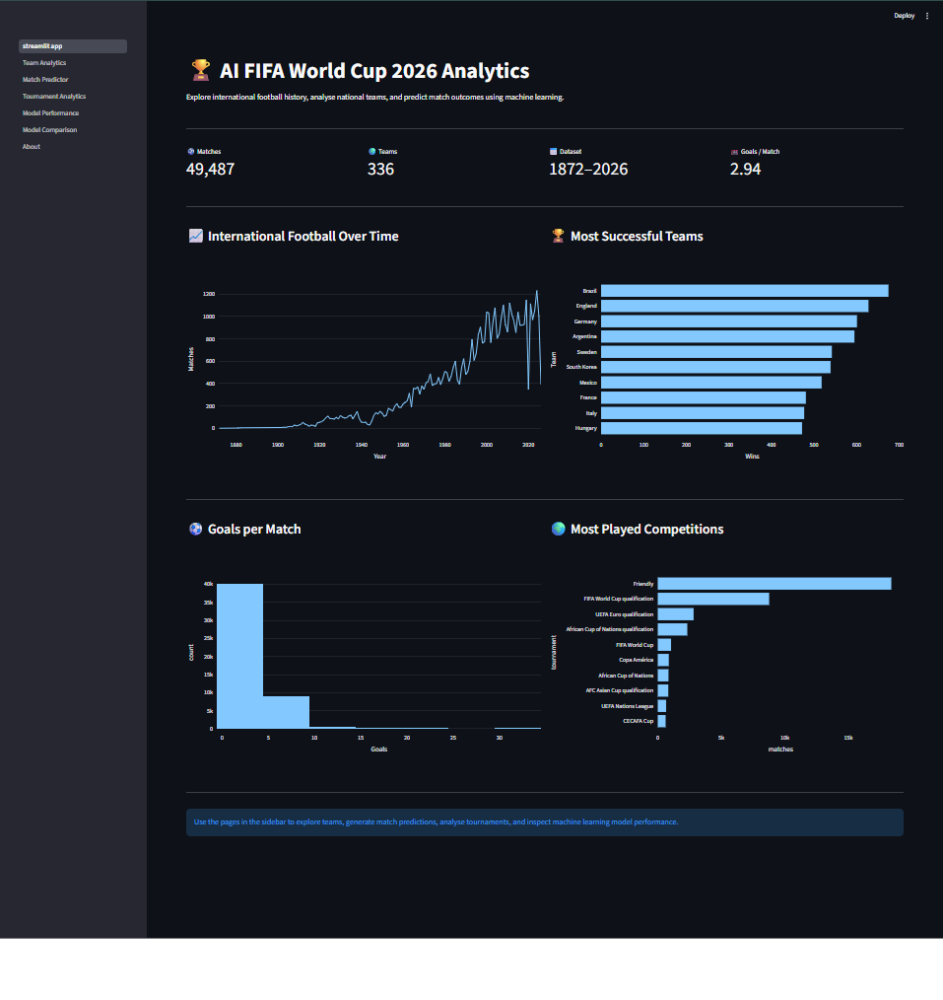
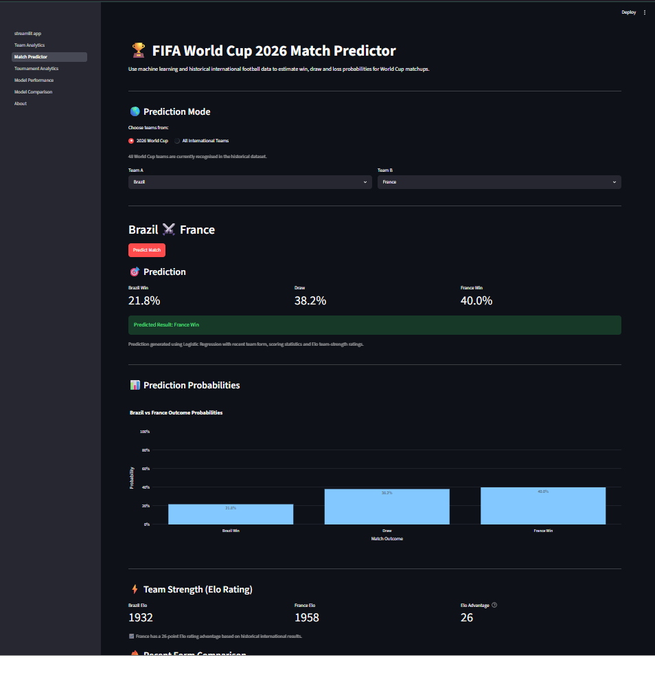
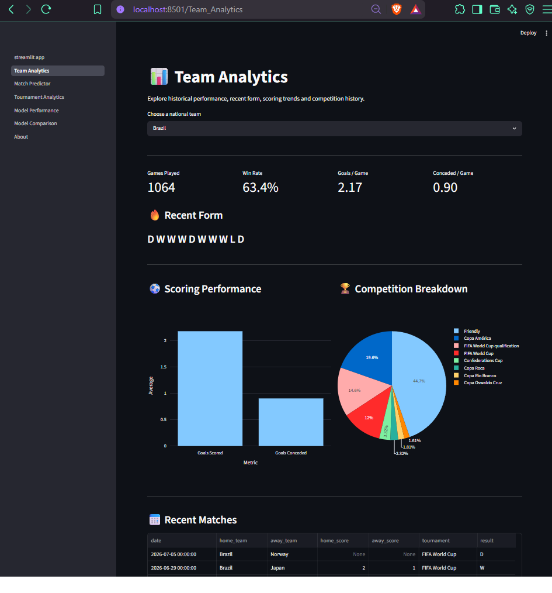
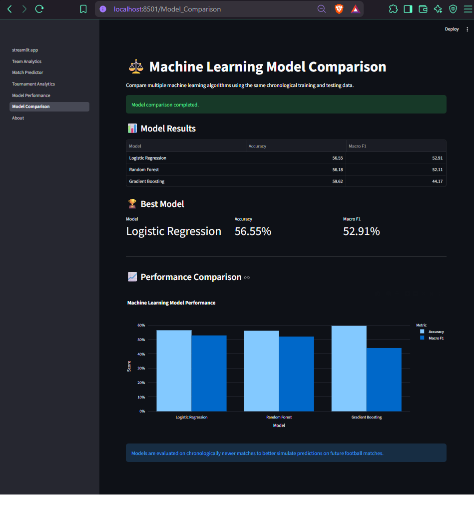

# AI World Cup Match Predictor 

An end-to-end machine learning application for predicting **2026 FIFA World Cup match outcomes** using historical international football data, recent team form, scoring statistics, and Elo team-strength ratings.

The project combines machine learning, feature engineering, football analytics, and an interactive Streamlit dashboard to estimate the probabilities of a **home win, draw, or away win**.

## Features

- Predict 2026 FIFA World Cup match outcomes
- Generate Home Win, Draw, and Away Win probabilities
- Elo rating system for modelling team strength
- Recent team form analysis
- Goals scored and conceded statistics
- Interactive team analytics
- Model performance analysis
- Comparison of multiple machine learning algorithms
- Interactive visualisations built with Plotly
- Streamlit-based web interface

## Machine Learning

Three classification algorithms were evaluated:

- Logistic Regression
- Random Forest
- Gradient Boosting

Models were evaluated using a **chronological 80/20 train-test split** rather than a random split. This ensures that models are trained on earlier matches and evaluated on later matches, better representing real-world football prediction.

### Model Performance

| Model | Accuracy | Macro F1 |
|---|---:|---:|
| Logistic Regression | 56.55% | 52.91% |
| Random Forest | 56.18% | 52.11% |
| Gradient Boosting | 59.62% | 44.17% |

**Logistic Regression** was selected as the final model because it achieved the strongest Macro F1 score, providing more balanced performance across Home Win, Draw, and Away Win outcomes.

## Feature Engineering

The prediction model uses features derived only from information available before each match, including:

- Recent win rate
- Recent goals scored
- Recent goals conceded
- Difference in team win rates
- Difference in recent goal difference
- Home and away Elo ratings
- Elo rating difference
- Neutral venue indicator

Elo ratings are updated chronologically after each match to avoid using future match information when constructing historical training features.

## Application

The Streamlit application includes:

- **Match Predictor** — select two teams and generate match outcome probabilities
- **Team Analytics** — explore historical performance and recent form
- **Model Comparison** — compare machine learning model performance
- **Model Performance** — inspect evaluation metrics and classification performance

### Application Screenshots

#### Analytics Dashboard

Overview of the historical international football dataset and key analytics.

#### Match Predictor

Interactive match prediction with win, draw, and loss probabilities based on team form and Elo ratings.

#### Team Analytics

Historical performance and recent-form analysis for individual international teams.

#### Model Comparison

Comparison of the machine learning models using accuracy and Macro F1.

#  Project Structure
ai-world-cup-match-predictor/
│
├── app/
│   ├── streamlit_app.py
│   └── pages/
│
├── utils/
│   ├── data_loader.py
│   ├── feature_engineering.py
│   ├── model_training.py
│   ├── prediction.py
│   └── elo.py
│
├── requirements.txt
├── .gitignore
└── README.md

## Technologies

- Python
- Pandas
- NumPy
- scikit-learn
- Streamlit
- Plotly
- Git & GitHub

## Dataset

The Streamlit application includes:

- The project uses historical international football match results to construct team form, scoring, and Elo-based features.

Match data is processed chronologically so that predictions and training features do not use information from future matches.

## Project Goal

- The goal of this project was to build an end-to-end machine learning system rather than only train a prediction model. It covers data preprocessing, feature engineering, model comparison, evaluation, football analytics, and deployment through an interactive web application.

## Disclaimer

- Predictions are generated from historical data and statistical patterns and should be treated as experimental model outputs rather than guaranteed match results.

## Author

-Augustus Jayawardene

- GitHub: @SashaneJay

